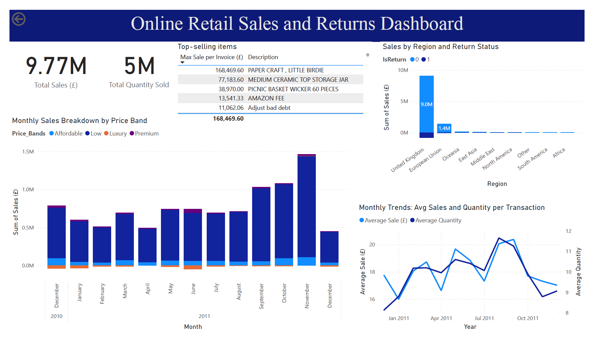

# Online Retail Sales and Returns Dashboard

## Objective
This project analyzes online retail sales data to understand customer purchasing behavior, product performance, and return patterns. The goal is to derive actionable insights that can help optimize pricing strategy, inventory planning, and customer satisfaction.

## Dashboard Features
- Key metric cards: **Total Sales** and **Total Quantity Sold**
- Monthly sales trends broken down by **price bands**: Low (< £10), Affordable (£10–£100), Premium (£100–£1000), and Luxury (> £1000)
- Regional sales and **return behavior analysis**
- Line chart comparing **average sales and quantity per transaction over time**
- Table of **top-performing products** by max sales in a single invoice

## Business Questions Answered
- What are the total sales and total items sold?
- Which price segments contribute most to revenue?
- What are the sales trends over months?
- Which products have the highest sales?
- Which regions bring the most revenue, and where are returns concentrated?
- Are sales increasing over time? What about average purchase size?

## Key Insights
- Total sales: **£9.77M**, with **5M items sold**
- **Strong seasonal pattern** with a significant sales spike in **November 2011** (likely holiday-driven)
- Sales are dominated by **low and affordable products**; luxury items underperform and may be loss drivers
- **United Kingdom** leads in both sales and return volume, followed by the **European Union**
- **Customers from South America and Africa appear to have stopped purchasing**, and **total sales from North America are steadily declining**, indicating potential regional disengagement
- **Average sale and average quantity per order are declining**, indicating customers are spending less per transaction
- Top products like **Paper Craft, Ceramic Jars**, and **Wicker Baskets** significantly outperform others

## Recommendations
- **Investigate luxury product profitability**; consider reducing offerings or adjusting pricing
- **Plan proactively for Q4** with inventory boosts and promotions to capture peak demand
- **Monitor decline in average order size**; explore bundling or loyalty incentives
- **Evaluate return drivers** in high-volume regions (UK) to address potential service or product quality issues

## File Contents
- `OnlineRetail_Dashboard.png`: Dashboard screenshot used in README
- `README.md`: Project summary and key findings

## Tools Used
- **Excel** (Initial inspection, cleaning, derived columns)
- **Power Query** (Minor transformations and custom columns)
- **Power BI** (Dashboarding and visualization)

## Data Source
Online Retail dataset from Kaggle: [Online Retail Dataset](https://www.kaggle.com/datasets/vijayuv/onlineretail)

---

> Created as part of a self-driven data analytics portfolio project. For questions or feedback, feel free to connect!
